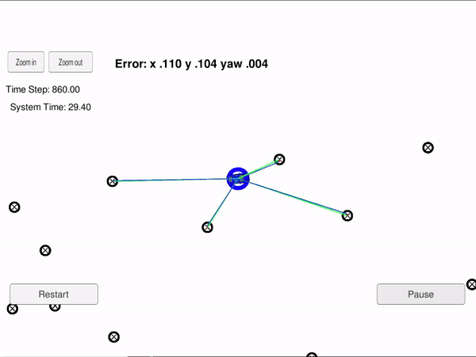

 

# Overview
This porject contains the C++ implementation of a 2D particle filter localization. The image shows the results tested with the Udacity's simulator. The blue circle shows the estimated position of the car. The green lines show the ground trugh measurement of the landmark measurements near the car. The blue lines show the predicted landmark measurement. 

# How does it work? 
A particle filter consists of a set of estimates of the system state (the particles) that are refined in a series of iterations. The particles are initialized using an initial rough estimate of the system state (for exmaple a GPS localiztion in case of a self-driving car). In the light of sensor measurements, at each iteration, the particles that are most likely to have a correct estimated of the system state are chosen for the next generaion. This process hopefully convergfes to a point that the set of all particles represent an accurate estimate of the posterior state of system. The idea of particle filters is very reminiscent of population-based metaheueristics, such as [evlolutionary algorithms](https://en.wikipedia.org/wiki/Evolutionary_algorithm). 

To estimate the state of the system using noisy motion model and noisy senosr observations, a particle filter continuously interates the following steps: 

1. Prediction: predict the state of the system using previous state and the motion model
2. Measurement Update: in light of the sensor measurements, assign each particle a weight that corresponds to its likliehood of representing a good estimate of the system state (an estimate that is in good adherence to the observation)
3. Resample: select the particles for the next generation. The probabailty for a particle to be selected is proportional to its weight

## Running the Code
This project involves the Udacity's Self-driving Car Nanodegree - Term 2 Simulator which can be downloaded [here](https://github.com/udacity/self-driving-car-sim/releases)

The simulator sends car measurements and contorl input using WebSockets to particle filter localization code. This repository includes two files that can be used to set up and install uWebSocketIO for either Linux or Mac systems. For windows you can use either Docker, VMware, or even Windows 10 Bash on Ubuntu to install uWebSocketIO.

Once the install for uWebSocketIO is complete, the main program can be built and ran by doing the following from the project top directory.

1. mkdir build
2. cd build
3. cmake ..
4. make
5. ./particle_filter

Here is the main protocol that main.cpp uses for uWebSocketIO in communicating with the simulator.

**INPUT: values provided by the simulator to the c++ program**
// sense noisy position data from the simulator for initialization.
["sense_x"]
["sense_y"]
["sense_theta"]

// get the previous velocity and yaw rate to predict the particle's transitioned state
["previous_velocity"]
["previous_yawrate"]

// receive noisy observation data from the simulator, in a respective list of x/y values
["sense_observations_x"]
["sense_observations_y"]


**OUTPUT: values provided by the c++ program to the simulator**
// best particle values used for calculating the error evaluation
["best_particle_x"]
["best_particle_y"]
["best_particle_theta"]

//Optional message data used for debugging particle's sensing and associations
// for respective (x,y) sensed positions ID label
["best_particle_associations"]

// for respective (x,y) sensed positions of the landmarks
["best_particle_sense_x"] <= list of sensed x positions 
["best_particle_sense_y"] <= list of sensed y positions


# Implementing the Particle Filter
The directory structure of this repository is as follows:

```
root
|   CMakeLists.txt
|   README.md
|
|___data
|   |   
|   |   map_data.txt
|   
|   
|___src
    |   helper_functions.h
    |   main.cpp
    |   map.h
    |   particle_filter.cpp
    |   particle_filter.h
```

The `particle_filter.cpp` in the `src` directory contains the scaffolding of a `ParticleFilter` class and some associated methods. The `src/main.cpp` contains the code that will actually be running the particle filter and calling the associated methods.

#### The Map*
`map_data.txt` includes the position of landmarks (in meters) on an arbitrary Cartesian coordinate system. Each row has three columns
1. x position
2. y position
3. landmark id

> * Map data provided by 3D Mapping Solutions GmbH.
